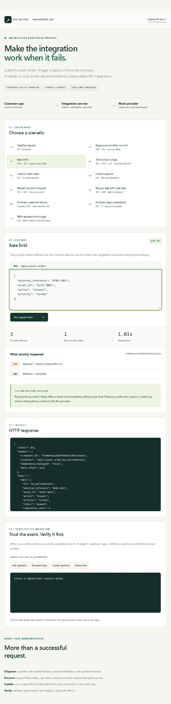
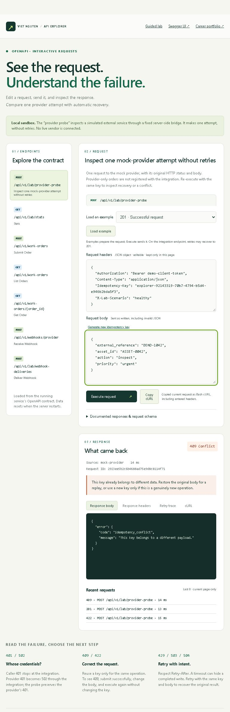
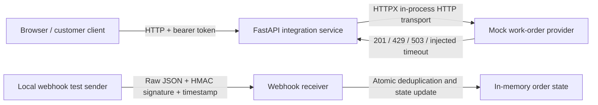

# API Reliability Lab

An interactive portfolio project by Viet Nguyen, developed with AI assistance.

**The question:** What happens when a provider creates a work order, but the customer never receives the response?

This small integration sandbox demonstrates the answer through real HTTP endpoints, an intentionally fallible mock provider, an interactive browser, and automated tests. It connects to Viet's utility-software implementation background without reusing employer code, customer data, or proprietary designs.



## Try the three-minute demo

1. Run **Response lost after commit**. Observe two attempts, the recovered original response, and exactly one new provider work order.
2. Run **Invalid caller token** or **Invalid payload**. Observe zero provider calls and an actionable error.
3. Run **Rate limit**. Observe the one-second Retry-After delay before recovery.
4. On a successful order, click **Deliver twice**. Both deliveries are acknowledged, but the completion side effect occurs once.
5. Inspect the response, request ID, OpenAPI contract, and tests. Use [WALKTHROUGH.md](WALKTHROUGH.md) for the explanation and interview questions.

## Run locally

Python 3.11 or newer is required. From this folder:

```powershell
python -m venv .venv
.\.venv\Scripts\python.exe -m pip install -r requirements-lock.txt
.\.venv\Scripts\python.exe -m uvicorn lab.app:app --host 127.0.0.1 --port 8765
```

Once installed on Windows, `./launch.ps1` starts the same local preview. On macOS/Linux, use `.venv/bin/python` in place of `.venv\Scripts\python.exe`.

- Interactive demo: http://127.0.0.1:8765
- Swagger-style error explorer: http://127.0.0.1:8765/explorer
- Standard Swagger UI: http://127.0.0.1:8765/docs
- Machine-readable contract: [openapi.json](openapi.json), also served at `/openapi.json`
- Public demo bearer token: `demo-client-token`

The token is intentionally public for the local sandbox. `LAB_CLIENT_TOKEN` can override it; update the UI field and test requests accordingly. Provider and webhook secrets are generated at startup and remain server-side.

## Inspect the provider boundary



Open `/explorer`. Its endpoint list and request schemas load from the running OpenAPI contract. Edit headers, path/query parameters, and raw JSON, then inspect the actual HTTP status, response headers, body, request ID, retry trace, and Bash cURL request. Request history and edited credentials remain in the current page; no browser storage is used.

The fixed-target `/api/v1/lab/provider-probe` makes exactly one in-process HTTP request to the mock provider. It preserves provider statuses such as 429 and 401, exposes Retry-After, and identifies the response source. An injected lost response becomes 504 with an unknown write outcome; reusing the same key recovers the original record. Probe-created orders are not registered in the integration, so use `/api/v1/work-orders` for webhook demos. This is not an arbitrary URL proxy or a live external vendor connection.

Try a rate limit in the probe (429), then in the integration (429 → 201). For 409, submit successfully, change the body, and execute again with the same key.

## The integration



The browser uses actual HTTP against the local server. Provider and webhook test-sender calls use HTTPX's in-process ASGI transport: real request/response handling without an external vendor or an additional server. Network loss is injected deliberately at the transport boundary. No Stedi, Rescale, or utility account is needed, and there are no paid API calls.

## What to review

| Capability | Demonstrated decision | Evidence |
|---|---|---|
| REST contracts | Versioned resource endpoints; input schemas; meaningful status codes; Location header | `lab/app.py`, `lab/models.py`, `openapi.json` |
| Authentication | Reject invalid caller tokens before provider work; distinguish upstream credential errors | 401 and provider-401 scenarios |
| Retry policy | Retry transient failures only; respect Retry-After; exponential delay with jitter; stop at three attempts or three seconds of waiting | `lab/client.py` |
| Safe writes | Preserve the same key across attempts; associate it with a canonical payload fingerprint | `lab/provider.py` |
| Concurrency | Concurrent identical submissions create one provider record within this process | `test_concurrent_same_key_creates_once` |
| Webhooks | Verify raw bytes with HMAC-SHA256 and a five-minute timestamp window before parsing or changing state | `receive_webhook` |
| Duplicate events | Same event ID is acknowledged without repeating the effect; conflicting reuse returns 409 | Webhook tests |
| Support diagnostics | Correlation ID and per-attempt decision trace; logs exclude credentials and payloads | Browser timeline and log test |
| Pagination | Bounded page sizes and opaque position cursors for append-only order state | List endpoint and pagination test |

## Test

```powershell
.\.venv\Scripts\python.exe -m pytest -q
```

Initial verification on September 29, 2026: **38 tests passed**. The installed Starlette test client emits a deprecation warning about its HTTPX adapter; the locked environment passes the suite. See [VALIDATION.md](VALIDATION.md) for the browser checks and scope of the evidence.

`requirements-lock.txt` records the tested dependency versions. `requirements.txt` expresses the direct dependency ranges. The virtual environment is excluded from the shareable source package.

## A manual request

Save the example below as a JSON body or use it in `/docs`:

```json
{"external_reference":"DEMO-1042","asset_id":"ASSET-0042","action":"inspect","priority":"normal"}
```

```bash
curl -i http://127.0.0.1:8765/api/v1/work-orders \
  -H 'Authorization: Bearer demo-client-token' \
  -H 'Content-Type: application/json' \
  -H 'Idempotency-Key: demo-order-1042' \
  -H 'X-Lab-Scenario: lost_response' \
  -d '{"external_reference":"DEMO-1042","asset_id":"ASSET-0042","action":"inspect","priority":"normal"}'
```

This cURL example uses Bash quoting; use Swagger's **Try it out** on Windows to avoid shell-quoting differences. Repeat with the same key and body, then change the priority without changing the key. The first repeat recovers the same ID; the changed request returns 409.

## Deliberate limits

This is a **local, single-tenant learning prototype**, not a production service or a performance benchmark.

- State and deduplication records are in memory and reset on restart. The lock protects one process, not multiple workers or machines. Production would need durable records, uniqueness constraints, transactions, and an explicit key-retention policy.
- There is no OAuth flow, per-customer authorization, distributed rate limiter, durable queue, or deployment hardening. The public demo token, scenario header, and signing test endpoint are local teaching controls; they should not be exposed as a production API.
- Retry waiting is bounded, but this is not a measured end-to-end network deadline. The ASGI mock does not exercise real socket, DNS, TLS, or connection-pool failures. A follow-on network test would use a separate provider process and real deadlines.
- A valid completion event arriving before the integration knows its work order returns 404 and is not consumed. Production needs a durable inbox/reconciliation policy for out-of-order delivery.
- The synthetic lifecycle is queued → completed. Claim adjudication, HPC scheduling, and real field-dispatch semantics are outside scope.
- Pagination uses a position cursor over an append-only collection; it is not a signed authorization token or a general-purpose snapshot cursor.

## Portfolio placement

Use [PORTFOLIO_CASE_STUDY.md](PORTFOLIO_CASE_STUDY.md) alongside the existing Enterprise OMS Implementation case study. The OMS page establishes prior professional context; this lab provides inspectable code and a reproducible demonstration. Add a short recording showing the lost-response case and duplicate webhook, plus a link to source and the tests. The source and case study belong in the career section of StudioVietProjects. The interactive backend runs locally; it has not been deployed as a public service.

## Design references

- [FastAPI testing](https://fastapi.tiangolo.com/tutorial/testing/): HTTP API test approach.
- [HTTPX transports](https://www.python-httpx.org/advanced/transports/): the in-process ASGI test boundary.
- [Stripe webhook documentation](https://docs.stripe.com/webhooks): raw-body verification, duplicate events, and timestamp checks as reference patterns. This lab uses its own simplified signature format and is not a Stripe integration.
